# ShitSwap

A modern decentralized exchange (DEX) frontend for swapping, providing liquidity, and viewing pool/transaction data on Ethereum-compatible networks.

---

## Project Preview

<!-- Paste your frontend screenshots or GIFs here -->

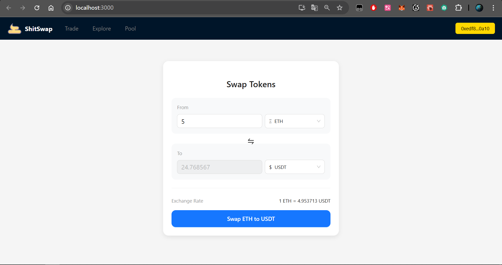
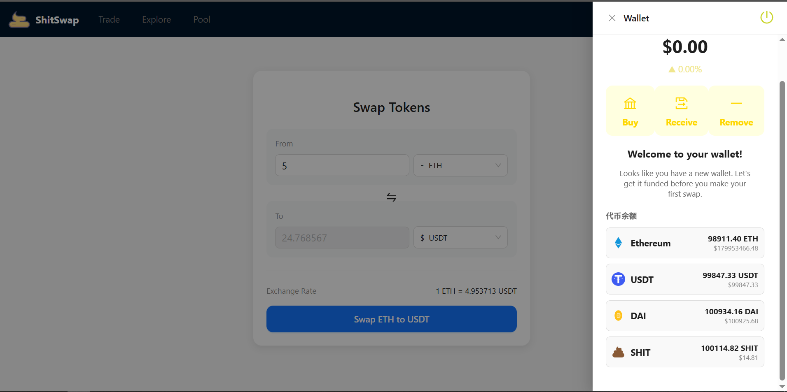
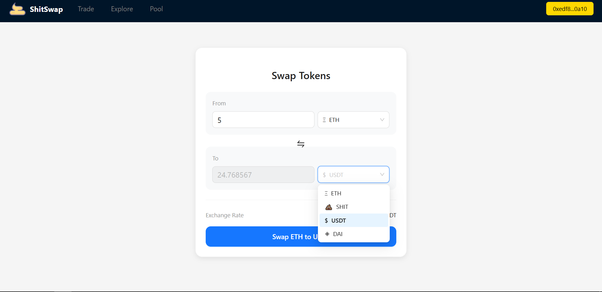
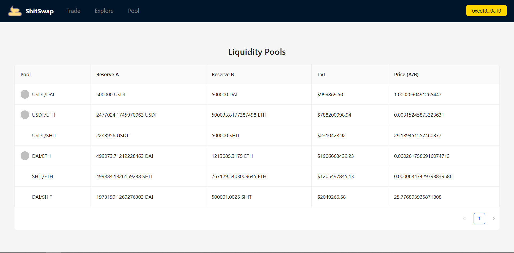
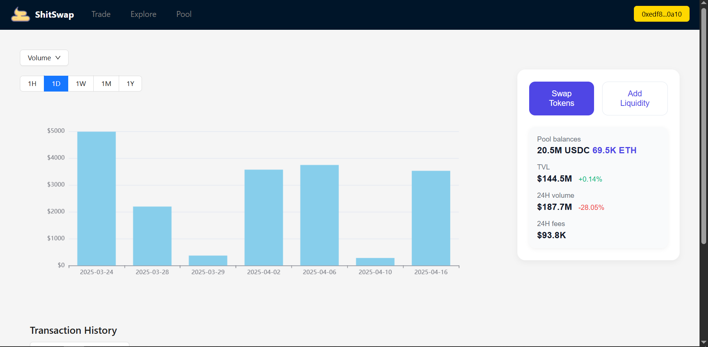
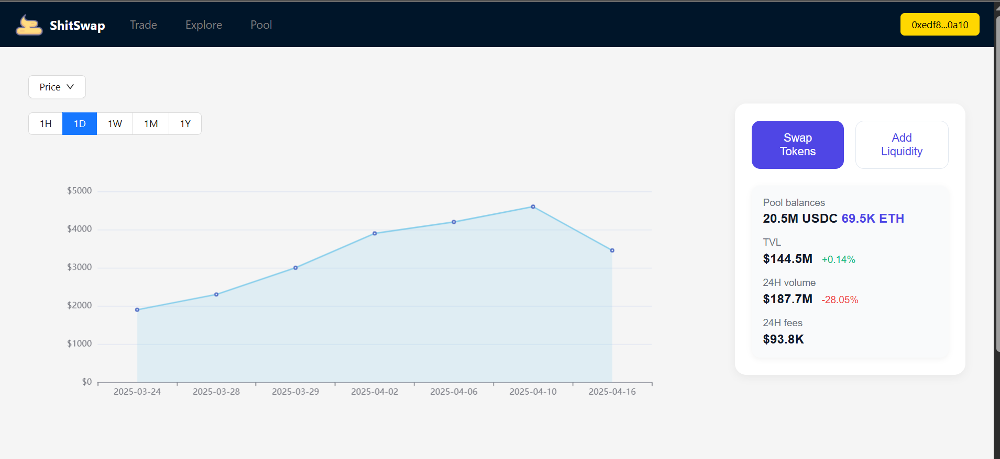
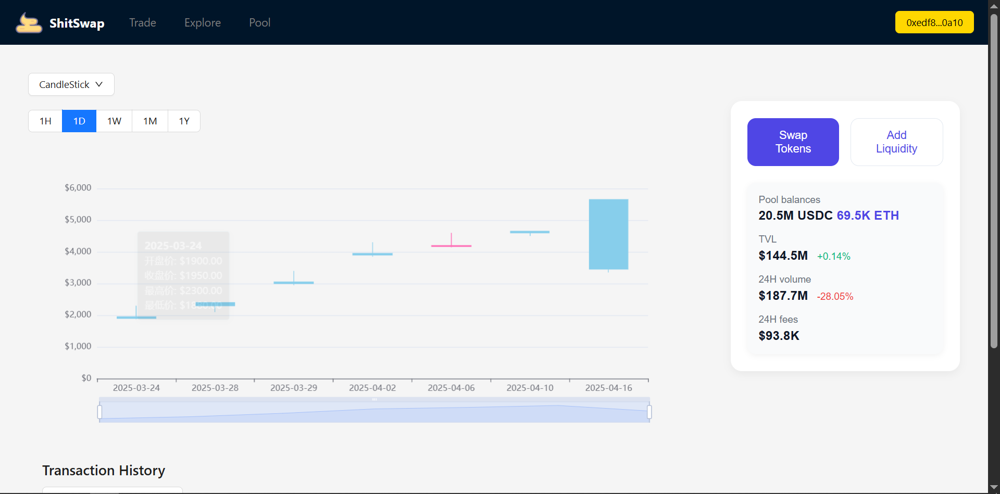
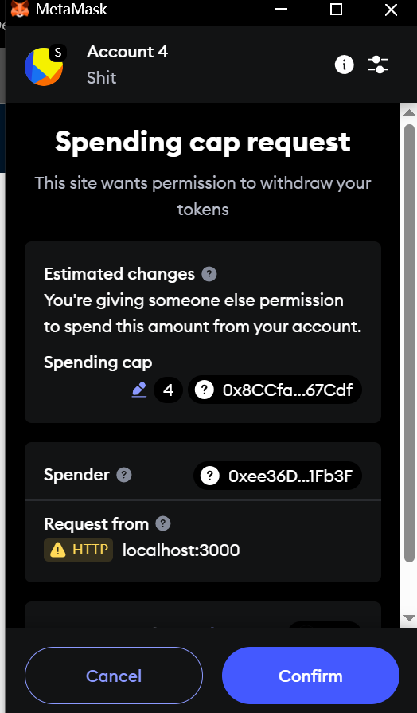
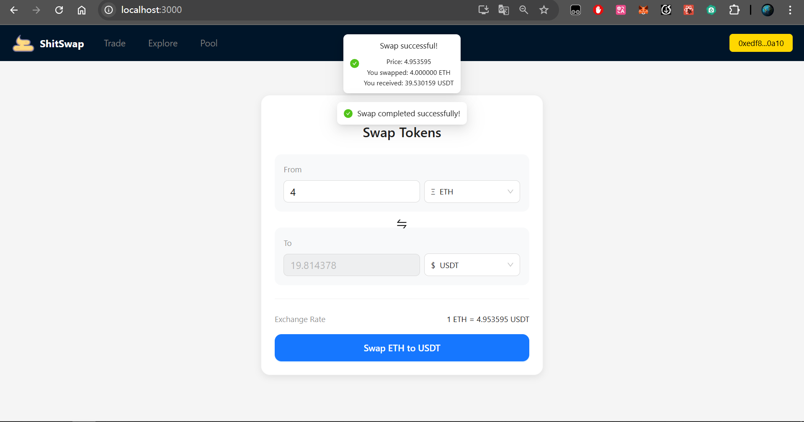
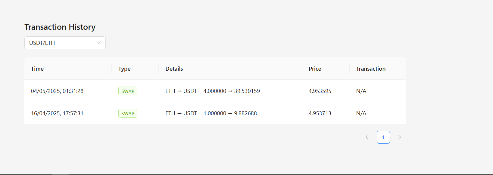
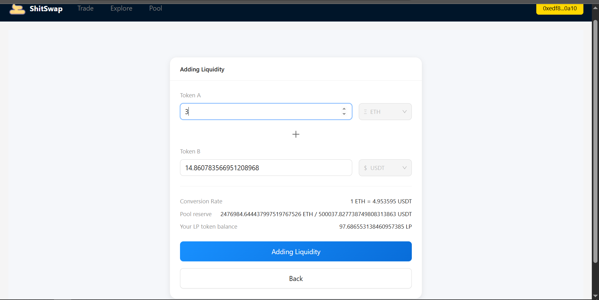
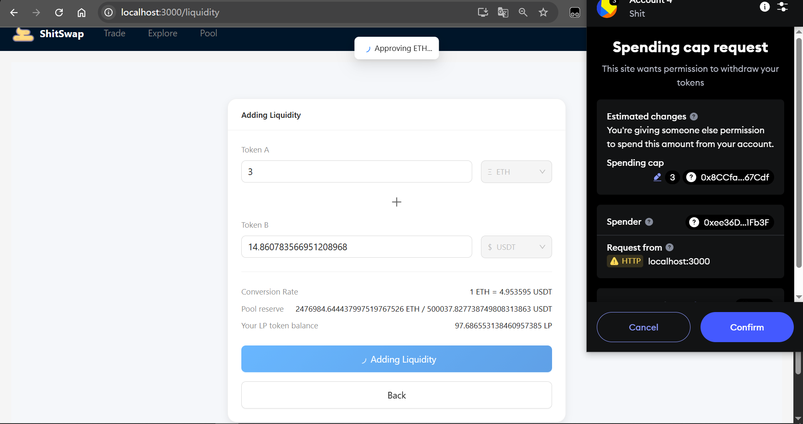
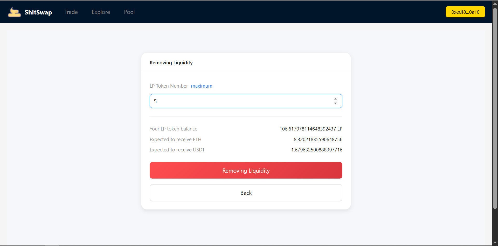
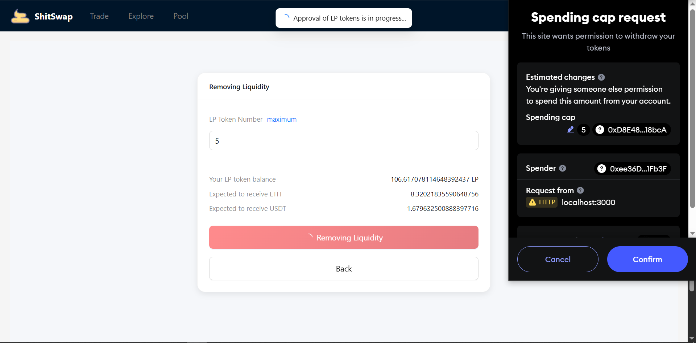

## Overview

ShitSwap is a React-based frontend for a decentralized exchange (DEX) supporting MetaMask wallet connection, token swaps, liquidity management, and real-time transaction history. It interacts directly with Ethereum smart contracts using ethers.js, providing a seamless DeFi user experience.

---

## Features

- **MetaMask Wallet Integration**  
  Connect and manage your Ethereum wallet securely.

- **Token Swapping**  
  Swap between multiple tokens with real-time price and slippage protection.

- **Liquidity Management**  
  Add or remove liquidity to supported pools.

- **Pool & Token Explorer**  
  View pool statistics, token info, and historical data.

- **Transaction History**  
  View and filter all swap and liquidity transactions, persisted across sessions.

- **Responsive UI**  
  Built with Ant Design v5 and styled-components for a modern look.

---

## Tech Stack

- **React** (SPA framework)
- **Ant Design v5** (UI components)
- **ethers.js v6** (blockchain interaction)
- **styled-components** (CSS-in-JS)
- **React Context** (global state management)
- **localStorage** (transaction history persistence)
- **Echarts** (data visualization)
- **React Router v7** (routing)

---

## Getting Started

### Prerequisites

- Node.js (v14+)
- MetaMask browser extension
- Deployed ShitSwap smart contracts (e.g., Sepolia or Hardhat localnet)

### Setup

1. **Clone the Repository**
   ```bash
   git clone <your-repo-url>
   cd frontend